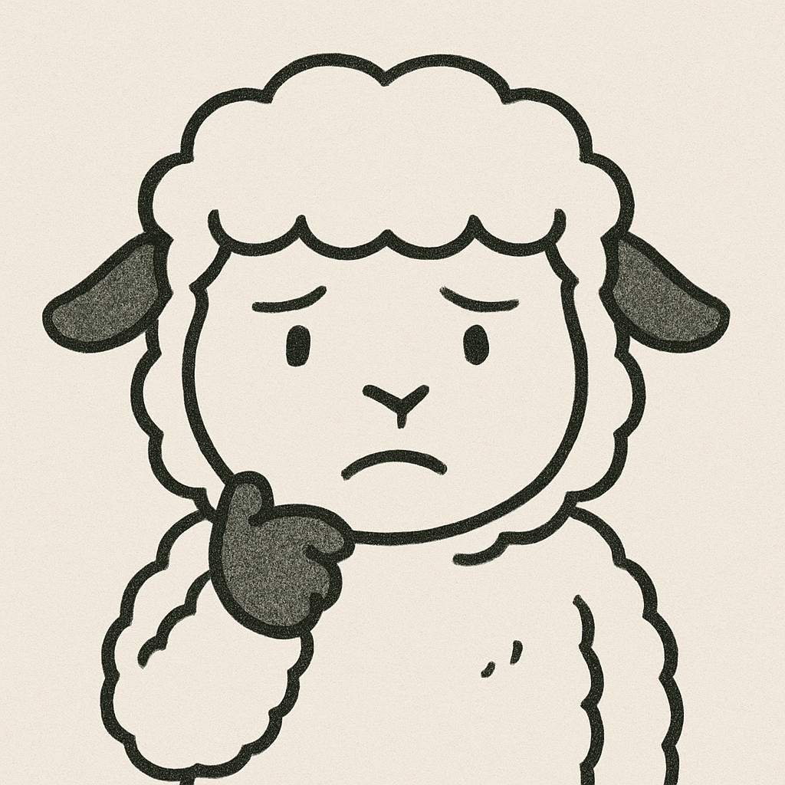
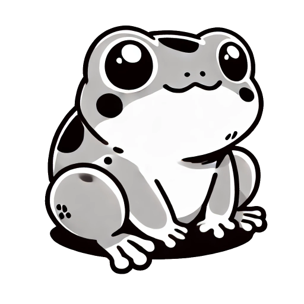
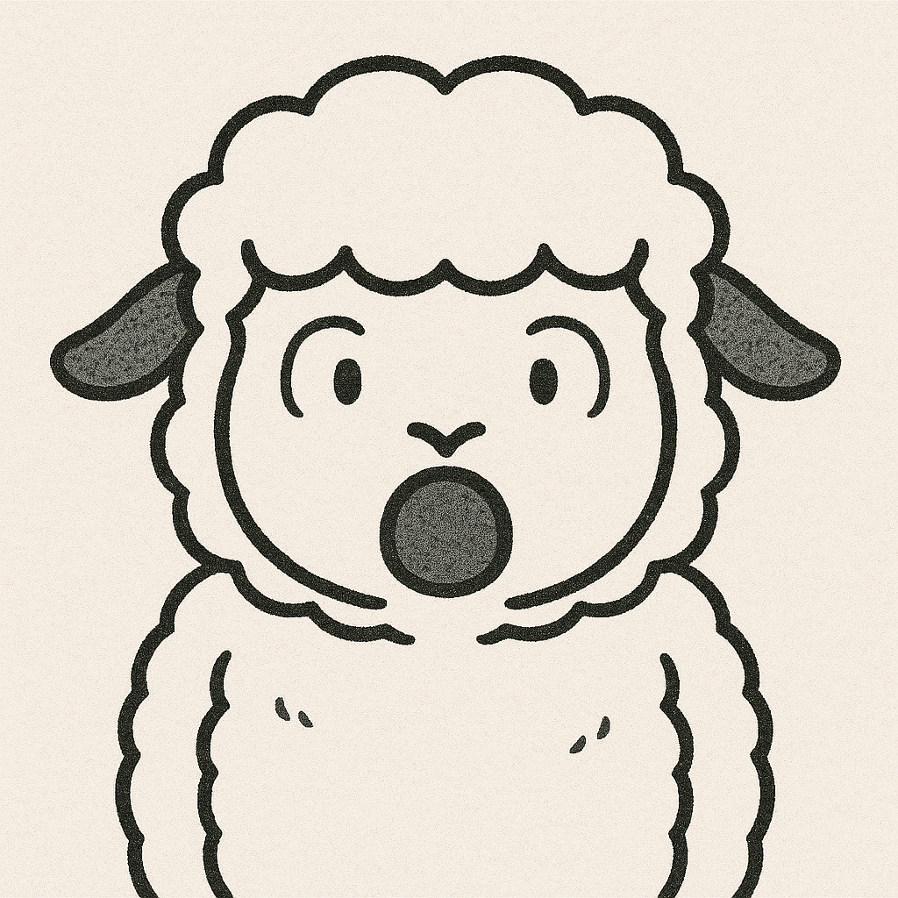

---
link:
  - rel: "stylesheet"
    href: "../../css/content-style.css"
---

## かえるくんの困りごと{#h2_1}

    <!-- ひつじさん -->
    

        

            
これはChatGPTも混乱するやつだね

        

        <figure class="ballon--figture__margin">
            
            <figcaption class="icon-name">ひつじさん</figcaption>
        </figure>
    

    <!-- かえるくん -->
    

        <figure class="ballon--figture__margin">
            
            <figcaption class="icon-name">かえるくん</figcaption>
        </figure>
        

            

                どうすればいいの！？
            

        

    

    <!-- ひつじさん -->
    

        

            
落ち着いて。1個1個じっくり確認しよう

        

        <figure class="ballon--figture__margin">
            
            <figcaption class="icon-name">ひつじさん</figcaption>
        </figure>
    

    <!-- かえるくん -->
    

        <figure class="ballon--figture__margin">
            
            <figcaption class="icon-name">かえるくん</figcaption>
        </figure>
        

            

                うん、わかった！
            

        

    

